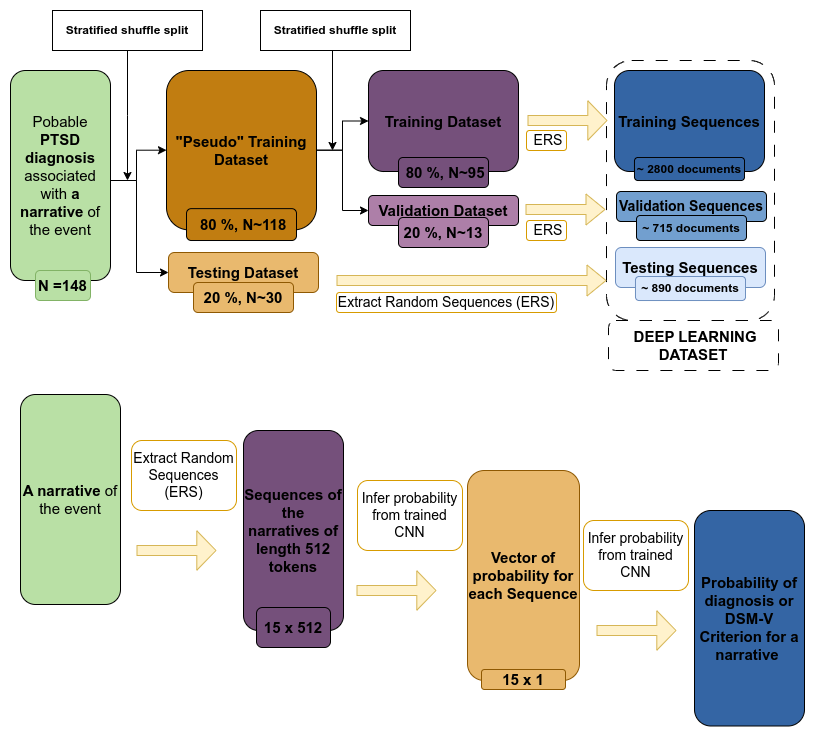

# DEEP TEXT CLASSIFIER

Binary long text classification with Deep Learning models.

## Description

You only need to have a datframe with 3 columns:
- text: the text to classify (list of word)
- label: the label of the text (0 or 1)
- id: the id of the text (int)

Place your dataset in the project directory `data/corpus` and update the file path in the config.yaml file, the column name and the parameter of the model you want to train.

### Exemple of a process build with this repository to classify PTSD from text

This repository is particularly adapted to classify small dataset of long text.

 We have used it to classify PTSD from text. The process is the following:

We provide an example corpus in the `data/corpus` folder based on french presidential campaign speeches. You can inspect and create classifier using this online tool: http://hyperbase.unice.fr/hyperbase/ 

## Installation
1. Clone this repository to your local machine.
2. Install the required packages: `pip install -r requirements.txt`.
3. Place your dataset in the project directory and update the file path in the script.
4. Run the main script: `python train_model.py 10`. If you want to train 10 models  for 10 random seed
5. Analyze results in the `results` folder and using the log file: `deep_classification_text.log`.

## Supports

This project receive the support from the following organization: 

